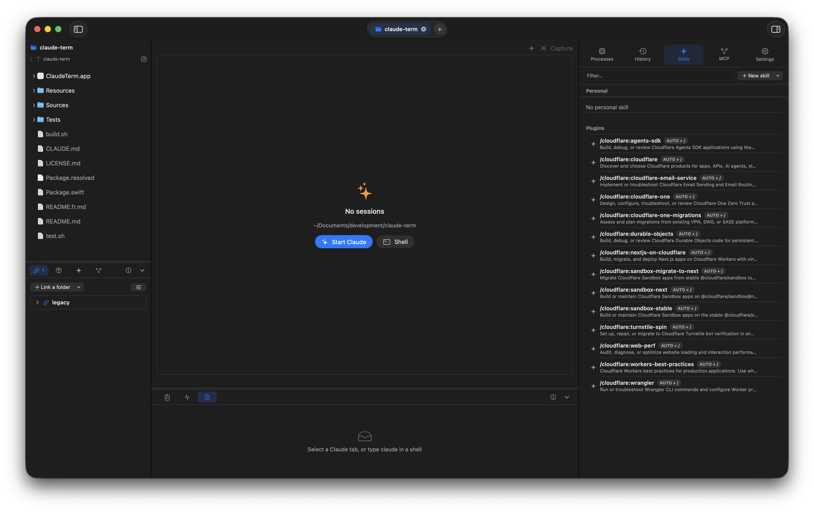

# ClaudeTerm

*[Version française](README.fr.md)*

A native macOS workbench for driving [Claude Code](https://claude.com/claude-code) across several projects.
Native terminal (SwiftTerm), one tab per project, and panels that read what Claude Code already writes to
disk (transcripts, plans, settings) without asking it anything.

macOS 14+, Apple Silicon. No external dependency besides `claude` in your PATH.
Interface in English or French (ClaudeTerm › Settings…).



*ClaudeTerm in dark mode: project Finder and linked folders on the left, terminal and session block in the center, global panels on the right.*

## Build

No Xcode required, only the Command Line Tools:

```
./build.sh        # swift build -c release + bundles ClaudeTerm.app (ad hoc signed)
open ClaudeTerm.app
./test.sh         # unit tests (Swift Testing)
```

To install on another Mac: zip `ClaudeTerm.app`, then clear quarantine (`xattr -d com.apple.quarantine`).

## Window layout

```
┌ title bar : [◧] (project A) (project B) (+)                          [◨] ┐
├──────────────┬────────────────────────────────────────┬──────────────────┤
│ Project      │ terminal tabs : shell · claude · dev    │ Processes        │
│ Finder       │ ┌────────────────────────────────────┐ │ History          │
│              │ │ native terminal                     │ │ Skills           │
│              │ └────────────────────────────────────┘ │ MCP              │
│ ─────────── │ folder · mode · tokens · state          │ Settings         │
│ 🔗 📦 ✨ ⛓ ⓘ ˅│ ─────────────────────────────────────── │                  │
│ links/scripts│ 📋 📈 📄  session   ⓘ ˅                  │                  │
│ skills/mcp   │ plan / activity / files                 │                  │
└──────────────┴────────────────────────────────────────┴──────────────────┘
```

**Left = the project, center = the session, right = global.**

### Projects (title bar)
One tab per open folder. `+` opens a blank project with the welcome screen (folder picker, recents).
Open projects are restored at launch, their terminals are not.
⌘N new project · ⌘O open folder · ⇧⌘W close · ⌥⌘[ ] switch project.

### Left column
- **Finder** bounded to the project root. Double-click: enter a folder / open a file. Back and parent
  arrows. Space: Quick Look. Drag a file onto the terminal to type its path.
  Right-click: Claude here, shell here, insert path, open as project.
- **Bottom block**, four modes (icons on the left, ⓘ explains the mode, chevron collapses):
  - 🔗 **Linked folders**: the projects this one depends on. See *Linked projects*.
  - 📦 **npm scripts**: scripts of `package.json` (workspaces and linked folders included), run in a
    reused tab. Package manager inferred from the lockfile.
  - ✨ **Project skills**: `.claude/skills/*/SKILL.md` and `.claude/commands/*.md`. See *Skills*.
  - ⛓ **Project MCP**: servers of `.mcp.json` (and linked folders). Add, edit, copy from another project.

### Center
- Terminal tabs: `+` / ⌘T shell, ⇧⌘T Claude, ⌘W close, ⇧⌘[ ] navigate.
- Green icon = command running, red = last script failed, sparkle = Claude.
- Typing `claude` in a shell is enough: the tab switches to Claude mode (plan, activity…).
- Images for Claude: drag and drop a file or an image, ⌥⌘S screenshot, ⌘V of an image.
  Everything becomes a file whose path is typed into the prompt.
- Status bar: folder, permission mode, plan, tokens, process state.
- **Session block** under the terminal, same pattern as the left column (⌥⌘3 collapses):
  - 📋 **Plan**: the plan-mode plan, markdown rendering, progress; opens by itself when Claude enters plan mode.
  - 📈 **Activity**: transcript feed (messages, tools, files), tokens.
  - 📄 **Files**: files touched by the session, with the exact diff of what Claude changed. The
    "before" state comes from Claude Code's own file-history backups (`~/.claude/file-history/<session>`),
    so the diff is per session, not per git state. Files created by Claude are shown against empty.

### Right panel
- **Processes**: every `claude` process on the Mac, its children, running tools. Stop on hover.
- **History**: sessions of the project or of all projects, search, resume (`--resume`), trash.
- **Skills**: personal skills (`~/.claude/skills`) and plugins.
- **MCP**: personal and local servers (`~/.claude.json`), claude.ai connectors and plugins with their
  status (`claude mcp list`, on demand). Add/remove through `claude mcp add|remove`.
- **Settings**: a form for `~/.claude/settings.json` (model, permissions, hooks, env, plugins).
  Unknown keys are preserved.

## Linked projects

The problem: front, API and design system are separate repositories, and you keep telling Claude
"go look in that folder". The solution relies on native Claude Code mechanisms:

- The project's `.claude/settings.local.json` gets the paths in `permissions.additionalDirectories`
  (direct access) and, for a read-only link, `deny` rules on Edit/Write
  (`//path/**` syntax: a single `/` would be project-relative).
- `.claude/claudeterm.json` keeps the roles ("api", "design system").
- `.claude/claudeterm-prompt.txt` describes the links; it is passed with `--append-system-prompt-file`
  by Claude tabs and by the `claude` function of the integrated shell.

## Skills

A skill is a `.claude/skills/<name>/SKILL.md` folder: `name` / `description` frontmatter, then the
instructions. Claude loads it by itself when the description matches, or through `/name`.
Three displayed modes: auto + `/` (default), manual only (`disable-model-invocation: true`),
auto only (`user-invocable: false`). Creation (empty or written by Claude), import of a `.md` or a
folder, drag and drop, editing in a sheet, copy between project and personal.

## MCP

Three scopes in Claude Code: **project** (`.mcp.json` at the root, shared), **local** (private, per
project, in `~/.claude.json`) and **user** (`~/.claude.json`). `.mcp.json` is written directly
(`mcpServers` key, everything else preserved); local and user scopes go through the `claude mcp` CLI so
`~/.claude.json` is never rewritten. Status (connected, auth required, failed) comes from
`claude mcp list`, which is slow, hence a button. "/mcp" sends the command to the Claude tab to authenticate.

## Notifications

Settings › Notifications › "Install the Claude Code hooks" adds two entries (`Notification`, `Stop`)
to `~/.claude/settings.json` pointing at `~/Library/Application Support/ClaudeTerm/hook.sh`. The script
spools the hook's JSON into an events folder that ClaudeTerm watches. Events are routed to the tab by
transcript path, then by folder, and shown as a dot on the tab, a count on the project, a badge on the
Dock icon and, when the tab is not visible, a macOS notification that focuses the tab when clicked.
Pending: permission requests (orange), idle prompts (yellow), finished responses (blue). Cleared when
the tab is shown or when the session moves on.

## Shell integration

Shell tabs get a private `ZDOTDIR` (`~/Library/Application Support/ClaudeTerm/zsh`) whose rc files
load your own zsh files then add `preexec`/`precmd` hooks. They emit an OSC 7770 sequence (command
start/end + exit code) and OSC 7 (current directory). No polling: tab state, idle-shell reuse and the
current folder all come from there. The shell is always zsh.

## What ClaudeTerm reads and writes

| Path | Role |
|---|---|
| `~/.claude/projects/<encoded path>/*.jsonl` | transcripts (read; trash from History) |
| `~/.claude/projects/<…>/sessions-index.json` | titles, dates, branch (read; cleaned on delete) |
| `~/.claude/plans/*.md` | plans (read) |
| `~/.claude/file-history/<session>/` | pre-edit backups, used for the session diff (read) |
| `~/.claude/settings.json` | global settings (form) |
| `<project>/.claude/settings.local.json` | linked folders, read-only rules |
| `<project>/.claude/claudeterm.json`, `claudeterm-prompt.txt` | link roles, system prompt |
| `<project>/.mcp.json` | project MCP servers (targeted writes) |
| `~/.claude.json` | user/local MCP servers (read only; writes go through `claude mcp`) |
| `~/Library/Application Support/ClaudeTerm/` | image drops, zsh rc |

The encoded path follows Claude Code's rule: every character outside `[a-zA-Z0-9]` becomes `-`.

## Localization

Source strings are French; `Resources/en.lproj/Localizable.strings` carries the English table and is
copied into the bundle by `build.sh`. Add a language by adding an `<lang>.lproj` folder.
The language picker in Settings writes `AppleLanguages` in the app's defaults and relaunches.

## Code

```
Sources/ClaudeTerm/
  App.swift             window, project bar, welcome screen, shortcuts, Settings scene
  AppSettings.swift     app preferences (language, appearance, notifications, terminal font)
  Notifications.swift   EventHub: hook script, events folder watcher, attention routing, macOS notifications
  Models.swift          TerminalSession (pty, transcript, shell events), Project, AppState
  TerminalViews.swift   center area: tabs, SwiftTerm host, status bar, session block
  FileBrowserView.swift Finder, bottom block (links / scripts / skills / mcp), listing cache
  ToolsPanel.swift      right panel: Processes, History, Plan (markdown), Activity, Files
  SettingsView.swift    settings.json form (SettingsModel)
  ClaudeData.swift      transcripts, index, plans
  Links.swift           linked projects (LinkStore) and roles editor
  Scripts.swift         package.json, scripts, workspaces
  Skills.swift          SkillStore, lists, create / edit / import sheets
  MCP.swift             MCPStore (.mcp.json, ~/.claude.json, claude mcp), panels, edit sheet
  ProcessMonitor.swift  ps + lsof
  ShellIntegration.swift  zsh rc + claude function
  Attachments.swift     image drop / capture / paste
  Theme.swift           terminal colors following the system appearance
  QuickLook.swift       Quick Look panel
  Localization.swift    L() helper
Tests/ClaudeTermTests/  tests of the pure parts (parsing, LinkStore, SettingsModel, skills, npm, MCP)
```

Known caveats: process ↔ tab matching uses folder and start time; the transcript and index formats
are not documented by Claude Code and may change.

## License

PolyForm Noncommercial 1.0.0. Free to use, modify and share for personal, educational, research and
non-profit purposes; any commercial use requires the author's permission. See [LICENSE.md](LICENSE.md).

Required Notice: Copyright Jérôme Laval.
